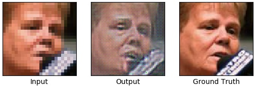
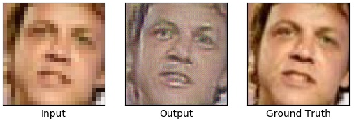
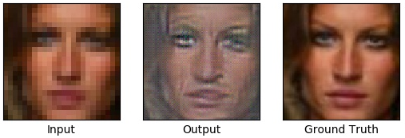

# Super Resolution using Generative Adversarial Network (SRGAN)

This is an implementation of the SRGAN model proposed in the paper
[Photo-Realistic Single Image Super-Resolution Using a Generative Adversarial Network](https://arxiv.org/abs/1609.04802)
with TensorFlow.

# Requirements

- Python 3
- TensorFlow
- OpenCV
- dlib

# Usage

## I. Pretrain the VGG-19 model.

Download the dataset with:

```
$ ./vgg19/cifar_100/download.sh
```

Preprocess the dataset with:

```
$ python vgg19/cifar_100/preprocess.py
```

Train with:

```
$ python vgg19/train.py
```

The pretrained VGG-19 model will be stored in [vgg19/model]().


## II. Train the SRGAN (ResNet-Generator and Discriminator) model.

Download the dataset with:

```
$ ./srgan/lfw/download.sh
```

Preprocess the dataset with:

```
$ python srgan/lfw/preprocess.py
```

Train with:

```
$ python srgan/train.py
```

The result will be stored in [src/result]().


# Results

## LFW






