# Super Resolution using Generative Adversarial Network (SRGAN)

This is an implementation of the SRGAN model proposed in the paper
([Photo-Realistic Single Image Super-Resolution Using a Generative Adversarial Network](
https://arxiv.org/abs/1609.04802))
with TensorFlow.

# Requirements

- Python 3
- TensorFlow 1.1
- OpenCV
- dlib

# Usage

## I. Pretrain the VGG-19 model

Download the ImageNet dataset and preprocess them with:

```
$ cd vgg19/imagenet
$ python get_urls.py
$ python create_db.py
$ python download_images.py
$ python preprocess.py
```

Train with:

```
$ cd vgg19
$ python train.py
```

Or you can download the pretrained model file:
[vgg19_model.tar.gz](
https://drive.google.com/open?id=0B-s6ok7B0V9vcXNfSzdjZ0lCc0k)


## II. Train the SRGAN (ResNet-Generator and Discriminator) model

Download the LFW dataset and preprocess them with:

```
$ cd /src/lfw
$ python lfw.py
```

Train with:

```
$ cd src
$ python train.py
```

The result will be stored in "src/result".


# Results

## LFW

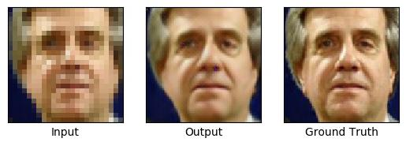

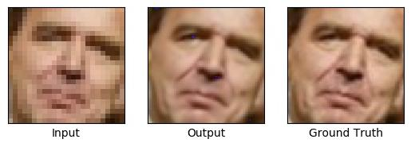

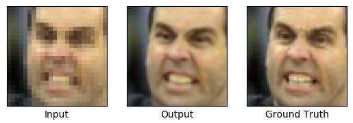

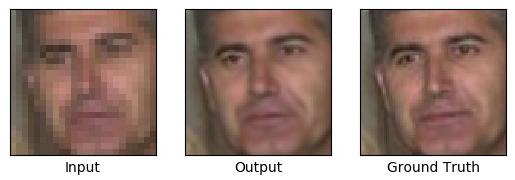

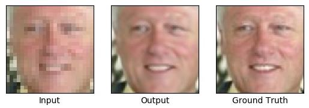

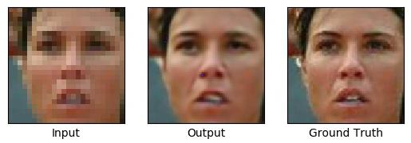

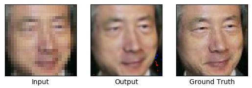

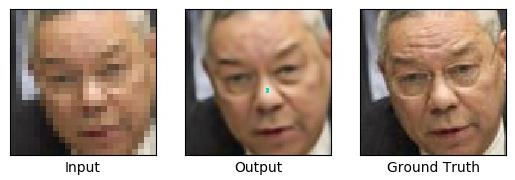

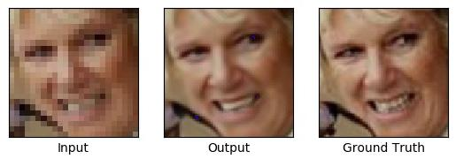

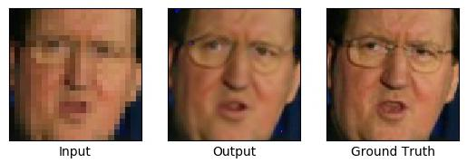

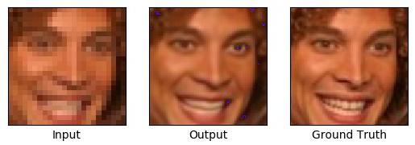

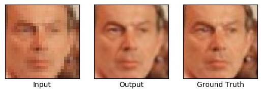

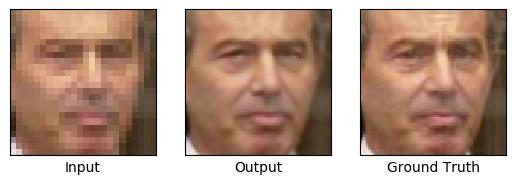

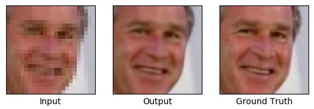

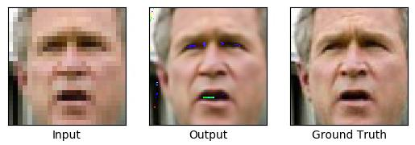

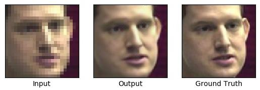


# Loss function

## Adversarial loss 

This implementation adopts the least squares loss function instead 
of the sigmoid cross entropy loss function for the discriminator.
See the details: [Least Squares Generative Adversarial Networks](
https://arxiv.org/abs/1611.04076)

## Content loss

The paper says VGG54 is the perceptually most convincing results.
But this implemetation uses all the feature maps generated by every layer
(i.e. phi12, phi22, phi34, phi44, phi54) within the VGG19 network.

